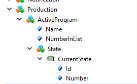

# OPC UA PubSub Interface Description for umati

This document defines the Interface of the umati Dashboard based on OPC UA PubSub.
It describes how a OPC UA server _AddressSpace_ must be mapped to OPC UA PubSub, so that the information can map to the umati Dashboard templates and displayed.

## Requirements for the Mapping of the _AddressSpace_ to PubSub

(Reference: [umati/UA-CloudPublisher#5](https://github.com/umati/UA-CloudPublisher/issues/5))

- Ability to react to dynamic changes in the _AddressSpace_ (nodes added/deleted)
  - Changes should be detected by monitoring NodeManagement events.
- Resolve references to nodes (NodeId as values)
- Hierarchy references must be mapped
- Non-hierarchy references should be mapped if necessary
  - Non-hierarchy references are mapped if relevant to the data semantics.
- Provide type information
- Methods should be considered
- Online detection (possibly as separate topics)
- Allow empty objects
- Events/alarms must be mappable
- Coordinate the completeness of the run
- Encoding should be UA JSON
- Dimensioning for approximately 350 subscribers (machines + dashboard users)
- Custom DataTypes must be included
- The _AddressSpace_ includes at least OPC UA Machinery and possibly other Companion Specifications based on it.
- The entry point of the mapping is the machine object in the Machines folder of Machinery.

## Status of the Publisher

As defined in OPC UA Part 14 the status should be send to the following topic:

`opcua/json/status/<PublisherId>` with  `<PublisherId>` as the name of the Client

- The value of the Field _`IsCyclic`_ should be `true` and
- the Status should be published at __least every 90 sec__ a higher frequency is possible.

## Application Description

The Application can be send optional.

## Connection

As defined in OPC UA Part 14 the connection should be send to the following topic:

`opcua/json/connection/<PublisherId>` with  `<PublisherId>` as the name of the Client.

The following parameter must be set:

- `WriterGroups.DataSetWriters.QueueName`
- `WriterGroups.DataSetWriters.MetaDataQueueName`

## Mapping

### General

- For identification of nodes, the name of the _DataSet_ with _ExpandedNodeId_ shall be used.

### Mapping of Objects and Variables

- An _Object_ is mapped to a _DataSet_.
- A _Variable_ is mapped as a field to the _DataSet_. If the _Variable_ contains children (other variables), a _DataSet_ with the children is created.

#### Example



The image shows a part of an _AddressSpace_. Each _Object_ is mapped to a _DataSet_:

- Production
- ActiveProgram
- State

The properties _Name_, _NumberInList_, _Id_, and _Number_ are fields of the _DataSet_. The value of _CurrentState_ is mapped as a field of _State_ and has a _DataSet_ with its properties:

- Production
- ActiveProgram
  - Name
  - NumberInList
  - State
    - CurrentState
- State
- CurrentState
  - Id
  - Number

### Explanation

A field can also contain properties but no other variables, even though the _AddressSpace_ can contain more hierarchies. Properties of objects also cannot be mapped to the properties of a field. Therefore, a uniform mapping is used for objects and variables so that access is always consistent.

## Mapping of Events

_Events_ are also mapped to a _DataSet_. Because _Events_ may have no _BrowsePath_, the _BrowsePath_ of the _SourceNam_ and the _EventName_ is used. The mapping itself is analogous to the mapping of objects.

## Topic Structure of DataSet and DataSetMetaData

The generic topic structure for OPC UA is:

`<Prefix>/<Encoding>/<MqttMessageType>/<PublisherId>/[<WriterGroup>[/<DataSetWriter>]]`

The mapping is based on the structure but deviates from it if necessary. The connection topic (see above) can still be used to read out the exact topic.

| Key               | Description                                                  |
|-------------------|--------------------------------------------------------------|
| `<Prefix>`        | umati/v3                                                     |
| `<Encoding>`      | json                                                         |
| `<MqttMessageType>` | as defined in OPC UA PubSub                                |
| `<PublisherId>`   | Name of the Client. Can be used for UNS Structure            |
| `[<WriterGroup>[/<DataSetWriter>]]` | PathToTheNode                              |

The PathToTheNode is the Path from the _0:Objects_ node to the _Node_ that is connected to the _DataSet_.
Generally, only hierarchical references are used. If a node occurs in two places, the message should be sent to both topics.
The use of _Organizes_ references can lead to loops in the path. In this case, only the shortest path should be transmitted.
Each _Node_ is a topic. The Topic name is build from the `name` field of the _BrowseName_. All character except `[A-Za-z0-9]` need to encode by [URL-Encoding](https://de.wikipedia.org/wiki/URL-Encoding) using an underscore instead of a '%'.
If two nodes have the same _BrowsePath_ an iterator (".Number") can be send to avoid collisions (e.g, `Parent/Tool.1`, `Parent.3/Tool.2` `Parent3/Tool.3` )

For _Events_ the _SourceNode_ and the _Name_ are used for the PathToTheNode

### Examples

_DataSet_ Topic

```text
umati/v3/json/data/example_publisher_1/machines/ShowcaseMachineTool/Identification
umati/v3/json/data/example_publisher_1/machines/ShowcaseMachineTool/Production/ActiveProgram
umati/v3/json/data/example_publisher_1/machines/ShowcaseMachineTool/Production/ActiveProgram/State
```

_DataSet_ Event Topic

```text
umati/v3/json/data/example_publisher_1/machines/ShowcaseMachineTool/Production/ActiveProgram/State/TransitionEventType
```

_DataSetMetaData_ Topic

```text
umati/v3/json/metadata/example_publisher_1/machines/ShowcaseMachineTool/Identification
umati/v3/json/metadata/example_publisher_1/machines/ShowcaseMachineTool/Production/ActiveProgram
umati/v3/json/metadata/example_publisher_1/machines/ShowcaseMachineTool/Production/ActiveProgram/State
```

## How to annotate the DataSet with semantics (e.g. TypeDefinition, References)

Here we see three possible variants of how this semantic information can be transferred. A decision as to which of the variants should be implemented has not yet been made.

### Variant A - Encoding as Field

This variant defines new _Fields_ in the _DataSet_ for the metadata if the metadata that cannot be stored in an existing entry.

#### DataSetMetaData

The fields of _DataSetMetaData_ should be mapped as follows:

- _Namespaces_ = as defined in Part 14
- _StructureDataTypes_ = as defined in Part 14
- _Name_ = BrowsePath with NamespaceUri instead of namespace index
- _Description_ = as defined in Part 14
- _Fields_ = Contains the field description of the variables/properties
  - _Name_ = ExpandedBrowseName (NamespaceUri#Name)
  - Properties = Not used
  - Other properties as defined in Part 14
- _DataSetClassId_ = as defined in Part 14
- _ConfigurationVersion = as defined in Part 14

If two nodes have the same _BrowsePath_ an iterator (".Number") can be send to avoid collisions (e.g., `Parent/Tool.1`, `Parent.3/Tool.2` `Parent3/Tool.3` )

#### Fix Field in the DataSet

The description field needs to contain the following entries. The JSON object can be extended vendor-specifically if necessary.

| Name                 | DataType       | Dimension | ModellingRule | Description                                                     |
|----------------------|----------------|-----------|---------------|-----------------------------------------------------------------|
| umati_Types                | QualifiedName     | Array    | optional      | Name of the type of the ObjectType or VariableType. Each empty in the array represents a supertype of the node. The first entry is the type itself.              |
| umati_TypeNodeID           | ExtendedNodeId | Scalar    |               | NodeId of the type of the ObjectType or VariableType            |
| umati_AdditionalBrowsePath | String         | Scalar    | optional      | If additional BrowsePaths exist, they can be included here      |
| umati_AdditionalReference  | KeyValuePair   | Array     | optional      | Additional references from the object, e.g., GenerateEvent      |
| umati_Description          | String         | Scalar    | optional      | Description as defined for the description field in Part 14     |

#### A - DataSetMetaData Example

```json
{
  "Namespaces": [
    "http://opcfoundation.org/UA/",
    "urn:DEMO-5:UA Sample Server",
    "http://opcfoundation.org/UA/DI/",
    "http://opcfoundation.org/UA/Machinery/",
    "http://opcfoundation.org/UA/IA/",
    "http://opcfoundation.org/UA/MachineTool/",
    "urn:Demo:MachineTool:myMachine/"
  ],
  "StructureDataTypes": "...",
  "Name": "5:Production.5:ActiveProgram.5:State",
  "Description": "my Description",
  "Fields": [
  {
    "Name": "umati_TypeNodeID",
    "Description": "as in Part 14",
    "FieldFlags": "as in Part 14",
    "BuiltInType": "12",
    "DataType": {"id": 12},
    "ValueRank": -1,
    "ArrayDimensions": "as in Part 14",
    "MaxStringLength": "as in Part 14",
    "DataSetFieldId": "as in Part 14",
    "Properties": "not used"
  },
  ...
  {
    "Name": "http://opcfoundation.org/UA/Machinery/#name",
    "Description": "as in Part 14",
    "FieldFlags": "as in Part 14",
    "BuiltInType": "12",
    "DataType": {"id": 12},
    "ValueRank": -1,
    "ArrayDimensions": "as in Part 14",
    "MaxStringLength": "as in Part 14",
    "DataSetFieldId": "as in Part 14",
    "Properties": "not used"
  },
  {
    "Name": "http://opcfoundation.org/UA/Machinery/#NumberInList",
    "Description": "as in Part 14",
    "FieldFlags": "as in Part 14",
    "BuiltInType": "5",
    "DataType": {"id": 5},
    "ValueRank": -1,
    "ArrayDimensions": "as in Part 14",
    "MaxStringLength": "as in Part 14",
    "DataSetFieldId": "as in Part 14",
    "Properties": "not used"
  }
  ]
}
```

#### A - DataSet

The _DataSet_ follows the _DataSetMetaData_ and other definitions of the specification. A _DataSet_ for the umati Dashboard needs to contain at least the Payload as RowData and a _DataSet_ message header with the following fields:

- Timestamp
- Status
- Name

#### A- DataSet Example

```json
{
  "Timestamp": "2021-09-27T18:45:19.555Z",
  "Status": 1073741824,
  "Name": "5:Production.5:ActiveProgram.5:State",
  "Payload": {
    "umati_Types":["5:ProductionProgramStateMachineType","0:FinteStateMachineType",...,"0:BaseObjectType"],"umati_TypeNodeID" : "nsu=http://opcfoundation.org/UA/Machinery/;i=58997",
    "umati_AdditionalReference" : [
    {"0:GeneratesEvents":"nsu=http://opcfoundation.org/UA/Machinery/;i=3444"}
    ]
    "Name": "Basic Program",
    "NumberInList": 0
  }
}
```

### Variant B - Encoding as JSON in the Description of the DataSetMetaData

This variant takes over the separation between _DataSet_ and _DataSetMetaData_ and maps the metadata in the _DataSetMetaData_. In order to remain standard-compliant, the metadata that cannot be stored in an existing entry is encoded in a JSON object in the description.

#### B - DataSetMetaData

The fields of _DataSetMetaData_ should be mapped as follows:

- _Namespaces_ = as defined in Part 14
- _StructureDataTypes_ = as defined in Part 14
- _Name_ = BrowsePath with NamespaceUri instead of namespace index
- Description_ = JSON object containing additional semantics (e.g., references)
- _Fields_ = Contains the field description of the variables/properties
  - Name = ExpandedBrowseName (NamespaceUri#Name)
  - Properties = Not used
  - Other properties as defined in Part 14
- _DataSetClassId_ = as defined in Part 14
- _ConfigurationVersion_ = as defined in Part 14

If two nodes have the same _BrowsePath_ an iterator (".Number") can be send to avoid collisions (e.g, `Parent/Tool.1`, `Parent.3/Tool.2` `Parent3/Tool.3` )

#### Description JSON

The description field needs to contain the following entries. The JSON object can be extended vendor-specifically if necessary.

| Name                 | DataType       | Dimension | ModellingRule | Description                                                     |
|----------------------|----------------|-----------|---------------|-----------------------------------------------------------------|
| Type                 | QualifiedName     | Array    | optional      | Name of the type of the ObjectType or VariableType. Each empty in the array represents a supertype of the node. The first entry is the type itself.              |
| TypeNodeID           | ExtendedNodeId | Scalar    |               | NodeId of the type of the ObjectType or VariableType            |
| AdditionalBrowsePath | String         | Scalar    | optional      | If additional BrowsePaths exist, they can be included here      |
| AdditionalReference  | KeyValuePair   | Array     | optional      | Additional references from the object, e.g., GenerateEvent      |
| Description          | String         | Scalar    | optional      | Description as defined for the description field in Part 14     |

#### B - DataSetMetaData Example

```json
{
  "Namespaces": [
    "http://opcfoundation.org/UA/",
    "urn:DEMO-5:UA Sample Server",
    "http://opcfoundation.org/UA/DI/",
    "http://opcfoundation.org/UA/Machinery/",
    "http://opcfoundation.org/UA/IA/",
    "http://opcfoundation.org/UA/MachineTool/",
    "urn:Demo:MachineTool:myMachine/"
  ],
  "StructureDataTypes": "...",
  "Name": "5:Production.5:ActiveProgram.5:State",
  "Description": "{\r\n
    \"Type\": \"5:ProductionProgramStateMachineType\",\r\n
    \"TypeNodeID\": \"nsu=http:\/\/opcfoundation.org\/UA\/Machinery\/;i=58997\",\r\n
    \"AdditionalReference\": [\r\n
  {\"GeneratesEvents\":\"nsu=http:\/\/opcfoundation.org\/UA\/Machinery\/;i=3444\"}\r\n
    ]\r\n
  }"
  "Fields": [
    {
    "Name": "http://opcfoundation.org/UA/Machinery/#name",
    "Description": "as in Part 14",
    "FieldFlags": "as in Part 14",
    "BuiltInType": "12",
    "DataType": {"id": 12},
    "ValueRank": -1,
    "ArrayDimensions": "as in Part 14",
    "MaxStringLength": "as in Part 14",
    "DataSetFieldId": "as in Part 14",
    "Properties": "not used"
    },
    {
    "Name": "http://opcfoundation.org/UA/Machinery/#NumberInList",
    "Description": "as in Part 14",
    "FieldFlags": "as in Part 14",
    "BuiltInType": "5",
    "DataType": {"id": 5},
    "ValueRank": -1,
    "ArrayDimensions": "as in Part 14",
    "MaxStringLength": "as in Part 14",
    "DataSetFieldId": "as in Part 14",
    "Properties": "not used"
    }
  ]
}
```

#### B - DataSet

The _DataSet_ follows the _DataSetMetaData_ and other definitions of the specification. A _DataSet_ for the umati Dashboard needs to contain at least the Payload as RowData and a _DataSet_ message header with the following fields:

- Timestamp
- Status
- Name

#### B - DataSet Example

```json
{
  "Timestamp": "2021-09-27T18:45:19.555Z",
  "Status": 1073741824,
  "Name": "5:Production.5:ActiveProgram.5:State",
  "Payload": {
    "Name": "Basic Program",
    "NumberInList": 0
  }
}
```

### Variant C - Extend the DataSetMeta

This variant extend the _DataSetMetaData_ with the needed fields. This variant may not comply with OPC UA Part 14 but contains all needed information and the separation between _DataSet_ and _DataSetMetaData_ is correct.

#### C - DataSetMetaData

The fields of _DataSetMetaData_ should be mapped as follows:

- _Namespaces_ = as defined in Part 14
- _StructureDataTypes_ = as defined in Part 14
- _Name_ = BrowsePath with NamespaceUri instead of namespace index
- _Description_ = as defined in Part 14
- _Fields_ = Contains the field description of the variables/properties
  - Name = ExpandedBrowseName (NamespaceUri#Name)
  - Properties = Not used
  - Other properties as defined in Part 14
- _DataSetClassId_ = as defined in Part 14
- _ConfigurationVersion_ = as defined in Part 14

If two nodes have the same _BrowsePath_ an iterator (".Number") can be send to avoid collisions (e.g, `Parent/Tool.1`, `Parent.3/Tool.2` `Parent3/Tool.3` )

Additional the following fields are defined:

| Name                 | DataType       | Dimension | ModellingRule | Description                                                     |
|----------------------|----------------|-----------|---------------|-----------------------------------------------------------------|
| Type                 | QualifiedName     | Array    | optional      | Name of the type of the ObjectType or VariableType. Each empty in the array represents a supertype of the node. The first entry is the type itself.              |
| TypeNodeID           | ExtendedNodeId | Scalar    |               | NodeId of the type of the ObjectType or VariableType            |
| AdditionalBrowsePath | String         | Scalar    | optional      | If additional BrowsePaths exist, they can be included here      |
| AdditionalReference  | KeyValuePair   | Array     | optional      | Additional references from the object, e.g., GenerateEvent      |
| Description          | String         | Scalar    | optional      | Description as defined for the description field in Part 14     |

#### C - DataSetMetaData Example

```json
{
  "Namespaces": [
    "http://opcfoundation.org/UA/",
    "urn:DEMO-5:UA Sample Server",
    "http://opcfoundation.org/UA/DI/",
    "http://opcfoundation.org/UA/Machinery/",
    "http://opcfoundation.org/UA/IA/",
    "http://opcfoundation.org/UA/MachineTool/",
    "urn:Demo:MachineTool:myMachine/"
  ],
  "StructureDataTypes": "...",
  "Name": "5:Production.5:ActiveProgram.5:State",
  "Type": "5:ProductionProgramStateMachineType",
  "TypeNodeID": "nsu=http://opcfoundation.org/UA/Machinery/;i=58997",
  "AdditionalReference": [
    {
      "GeneratesEvents": "nsu=http://opcfoundation.org/UA/Machinery/;i=3444"
    }
  ],
  "Fields": [
    {
      "Name": "http://opcfoundation.org/UA/Machinery/#name",
      "Description": "as in Part 14",
      "FieldFlags": "as in Part 14",
      "BuiltInType": "12",
      "DataType": {"id": 12},
      "ValueRank": -1,
      "ArrayDimensions": "as in Part 14",
      "MaxStringLength": "as in Part 14",
      "DataSetFieldId": "as in Part 14",
      "Properties": "not used"
    },
    {
      "Name": "http://opcfoundation.org/UA/Machinery/#NumberInList",
      "Description": "as in Part 14",
      "FieldFlags": "as in Part 14",
      "BuiltInType": "5",
      "DataType": {"id": 5},
      "ValueRank": -1,
      "ArrayDimensions": "as in Part 14",
      "MaxStringLength": "as in Part 14",
      "DataSetFieldId": "as in Part 14",
      "Properties": "not used"
    }
  ]
}
```

#### C - DataSet

The _DataSet_ follows the _DataSetMetaData_ and other definitions of the specification. A _DataSet_ for the umati Dashboard needs to contain at least the Payload as RowData and a _DataSet_ message header with the following fields:

- Timestamp
- Status
- Name

#### C - DataSet Example

```json
{
  "Timestamp": "2021-09-27T18:45:19.555Z",
  "Status": 1073741824,
  "Name": "5:Production.5:ActiveProgram.5:State",
  "Payload": {
    "Name": "Basic Program",
    "NumberInList": 0
  }
}
```
